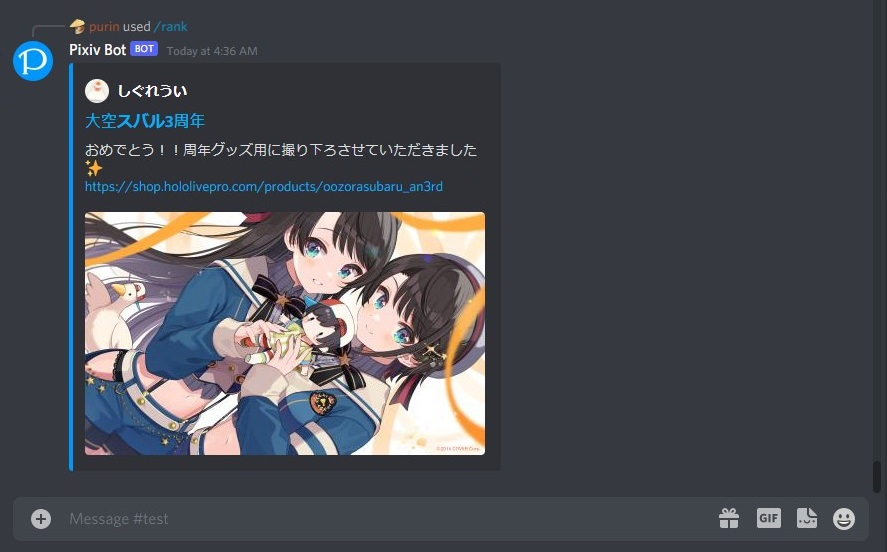

# Pixiv-Discord-Bot

[](https://github.com/purindaisuki/pixiv-discord-bot/tree/master/src/__tests__)
[](https://github.com/purindaisuki/pixiv-discord-bot/blob/master/LICENSE)

Pixiv-Discord-Bot allows you to get illustrations from [Pixiv](https://www.pixiv.net/) on Discord servers.



## Requirement

- Node.js >= 16.6.0
- A server for hosting
- A Discord developer account
- A Pixiv account

## Configuration

Create a `.env` file and fill in the variables shown below.

```
NODE_ENV=development

PROXY=https://your.server.com
PORT=1234

# Your discord bot token
BOT_TOKEN=xxxxxxxxxxxxxxxxxxxxxxx
# Your application client ID
CLIENT_ID=xxxxxxxxxxxxxxxxxxxxxxx
# Your server ID for development
GUILD_ID=xxxxxxxxxxxxxxxxxxxxxxx

PIXIV_REFRESH_TOKEN=xxxxxxxxxxxxxxxxxxxxxxx
```

For Pixiv refresh token, you can use [this script](https://gist.github.com/ZipFile/c9ebedb224406f4f11845ab700124362) written by [ZipFile](https://github.com/ZipFile) to retrieve it.

In the `config.ts` file, you can edit the prefix of text commands.

## Commands

Pixiv-Discord-Bot uses text commands and [slash commands](https://support.discord.com/hc/en-us/articles/1500000368501-Slash-Commands-FAQ) to interact with users. For text commands, bot works after users press `enter`. As for slash commands, when users type `/` in message bar on Discord, the commands show automatically.


Commands are shown below:

### Text commands:

- `prefix`**help** - Show helps for the bot usage

### Slash commands:

- **/search latest `query` \[`number`\]** - Search first `number` latest illustrations by a query
- **/search popular `query` \[`number`\]** - Search first `number` popular illustrations by a query
- **/rank day \[`r18`\] \[`number`\]** - Return first `number` day ranking illustrations
- **/rank week \[`r18`\] \[`number`\]** - Return first `number` week ranking illustrations
- **/rank month \[`number`\]** - Return first `number` month ranking illustrations
- **/new \[`number`\]** - Return first `number` latest illustrations
- **/recommend \[`number`\]** - Return first `number` recommended illustrations
- **/followed \[`number`\]** - Return first `number` followed illustrations

### Hosting

`.replit` and `replit.nix` are config files for hosting on Repl.it.

[](https://replit.com/@purindaisuki/pixiv-discord-bot)

You can use other services to host your bot.

## License

MIT
